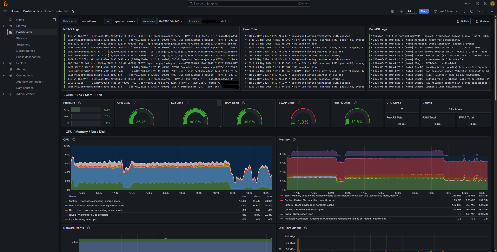

# Observability Stack for Live Product

Telemetry collection and monitoring configuration for a live commercial WordPress platform serving 4,000–5,000 daily sessions. Collection agents run on the application host; storage and visualization are offloaded to a dedicated monitoring server.

---

## Architecture

```text
[ Host A: Application Server ]              [ Host B: Monitoring Server ]

  +------------------------------+            +---------------------------+
  | node-exporter  :9100         | -- HTTP -> | Prometheus                |
  | cAdvisor       :8080         | -- HTTP -> |                           |
  | Promtail                     | -- HTTP -> | Loki          :3100       |
  +------------------------------+            +---------------------------+
                                                           |
                                                           v
                                              +---------------------------+
                                              | Grafana Dashboard         |
                                              +---------------------------+
```

---

## Components

**Host A — Collection Agents**
- **node-exporter:** Host OS metrics via read-only `/proc` and `/sys` mounts.
- **cAdvisor:** Per-container CPU, memory, and I/O metrics via container runtime cgroups.
- **Promtail:** Tails container stdout/stderr via Docker socket, forwards structured logs to Loki over HTTP.

**Host B — Monitoring Server**
- **Prometheus:** Scrapes node-exporter (9100) and cAdvisor (8080) on Host A.
- **Loki:** Ingests log streams from Promtail. Chosen over ELK for lower resource footprint at this scale.
- **Grafana:** Unified dashboard connecting Prometheus and Loki data sources.

---

## Security

Agent endpoints are proxied through NGINX with HTTP Basic Authentication, accessible via `/metrics/vps` and `/metrics/containers`. Direct port access (9100, 8080) is firewall-restricted to internal network only.

## Dashboard


*Live production telemetry — NGINX/MariaDB logs, CPU/memory utilization under real traffic.*