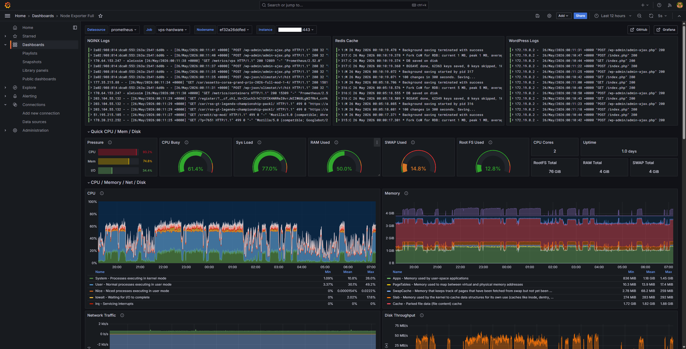

# Observability Stack for Live Product

[](https://prometheus.io/)
[](https://grafana.com/)
[](https://grafana.com/oss/loki/)
[](https://docs.docker.com/compose/)

Monitoring configuration for a *[live commercial WordPress platform](https://github.com/aleixnguyen-vn/simracing-community-platform-stack)* serving 4,000-5,000 daily sessions. The stack follows a decentralized design: lightweight collection agents run alongside the application, while all storage and visualization workloads are handled by a dedicated monitoring server to keep observability overhead off the production host.

---

## Architecture

```text
[ Host A: Application Server ]              [ Host B: Monitoring Server ]

  +------------------------------+            +---------------------------+
  | node-exporter  :9100         | -- HTTP -> | Prometheus                |
  | cAdvisor       :8080         | -- HTTP -> |                           |
  | Promtail                     | -- HTTP -> | Loki          :3100       |
  +------------------------------+            +---------------------------+
                                                           |
                                                           v
                                              +---------------------------+
                                              | Grafana Dashboard         |
                                              +---------------------------+
```

---

## Components

### [Host A - Collection Agents](./wordpress-monitoring-agents/)

Stateless agents with a minimal footprint. No persistent storage runs on the application host.

- **node-exporter:** Exposes host OS metrics (CPU, memory, disk, network) via read-only `/proc` and `/sys` mounts. Zero binary installation on the bare-metal OS.
- **cAdvisor:** Reads container runtime cgroups to surface per-container CPU, memory, and I/O utilization in real time.
- **Promtail:** Discovers running containers via the Docker socket, tails stdout/stderr streams, and forwards structured log chunks to Loki over HTTP.

Agent ports (9100, 8080) are not exposed directly to the internet. Access is proxied through NGINX with HTTP Basic Authentication, and firewall rules restrict direct port access to Host B's IP only.

### [Host B - Monitoring Server](./wp-monitoring-dash/)

Handles all compute-heavy operations independently from the production workload.

- **Prometheus:** Scrapes metrics from node-exporter and cAdvisor on Host A over HTTPS with basic auth. Retention is set to 14 days.
- **Loki:** Receives and indexes log streams from Promtail. Selected over the ELK stack for its lower resource footprint and native Grafana integration at this scale.
- **Grafana:** Connects to both Prometheus and Loki data sources, providing a unified view of infrastructure metrics and container logs.

---

## Dashboard


*Live production telemetry - NGINX, Redis Cache (Panel Title) and MariaDB log streams alongside CPU, memory, and system load under real user traffic.*

---

## Proof of Work

Verification artifacts (endpoint curl responses, basic auth headers, Grafana data source configuration, data over hours) are available in [/artifacts](./artifacts).